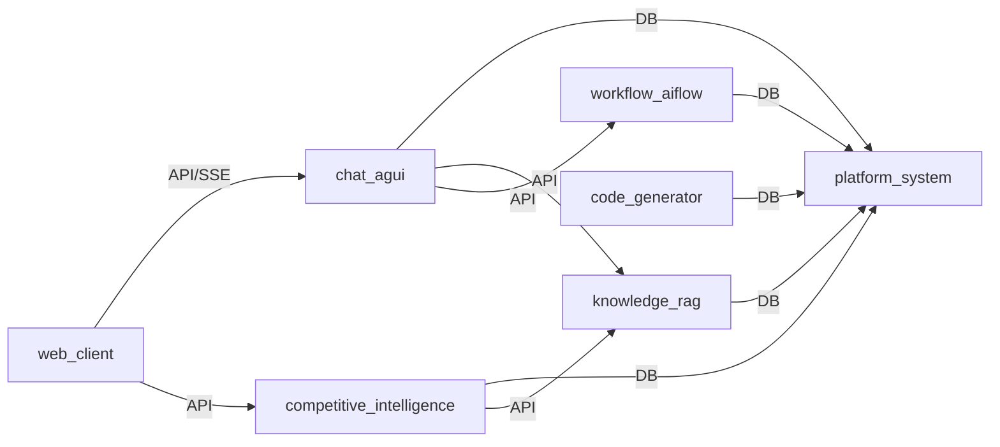

# Components Index（地图层：只导航）

| module | priority | owner | code_entry | api_contract | data_contract | ops_entry | status |
|--------|----------|-------|------------|--------------|---------------|-----------|--------|
| competitive-intelligence | P0 | Nova | `nova-backend/nova-modules/nova-intelligence/`, `nova-web/src/pages/intelligence/` | [api](./competitive-intelligence.md#api-contract) | [data](./competitive-intelligence.md#data-contract) | [ops](../ops/index.md) | - [x] |
| chat-agui | P0 | Nova | `nova-backend/nova-modules/nova-chat/`, `nova-web/src/pages/chat/` | [api](./chat-agui.md#api-contract) | [data](./chat-agui.md#data-contract) | [ops](../ops/index.md) | - [x] |
| web-client | P0 | Nova | `nova-web/src/` | [api](./web-client.md#api-contract) | [data](./web-client.md#data-contract) | [ops](../ops/index.md) | - [x] |
| platform-system | P1 | RuoYi/Nova | `nova-backend/nova-modules/nova-system/`, `nova-backend/nova-admin/` | [api](./platform-system.md#api-contract) | [data](./platform-system.md#data-contract) | [ops](../ops/index.md) | - [ ] |
| knowledge-rag | P1 | RuoYi/Nova | `nova-backend/nova-modules/nova-chat/src/main/java/org/ruoyi/controller/knowledge/` | [api](./knowledge-rag.md#api-contract) | [data](./knowledge-rag.md#data-contract) | [ops](../ops/index.md) | - [ ] |
| workflow-aiflow | P1 | RuoYi/Nova | `nova-backend/nova-modules/nova-aiflow/`, `nova-backend/nova-modules/nova-workflow/` | [api](./workflow-aiflow.md#api-contract) | [data](./workflow-aiflow.md#data-contract) | [ops](../ops/index.md) | - [ ] |
| code-generator | P1 | RuoYi/Nova | `nova-backend/nova-modules/nova-generator/` | [api](./code-generator.md#api-contract) | [data](./code-generator.md#data-contract) | [ops](../ops/index.md) | - [ ] |
| nova-chatbot | P2 |  | `nova-chatbot/` |  |  |  | - [ ] |
| nova-copilot | P2 |  | `nova-copilot/` |  |  |  | - [ ] |
| nova-portal | P2 |  | `nova-portal/` |  |  |  | - [ ] |

## Dependencies（direct only）

