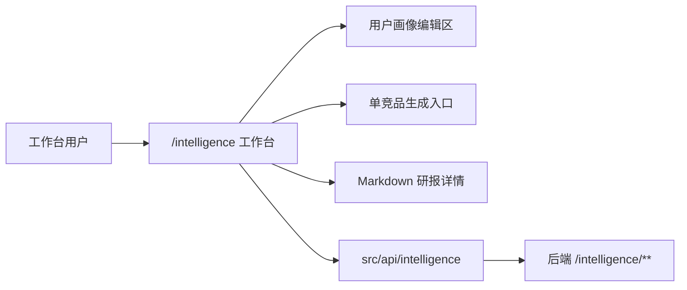

# 用户画像驱动竞品研报前端 RFC

## 0. 基本信息

- 需求标识（分支 / ID）：`003-user-profile-research-report`
- 标题（需求名 / RFC 名）：用户画像驱动竞品研报前端 RFC
- 作者：Codex
- 评审人：Nova
- 状态：draft
- 最后更新：2026-07-09
- 关联链接：`../requirements/solution.md`

## 1. 结论摘要

- 一句话目标：在 `/intelligence` 工作台内新增我方用户画像管理、单竞品手动生成画像研报和美观的 Markdown 在线研报阅读体验。
- In / Out 边界：MVP 覆盖画像编辑、版本信息、手动生成、生成状态、历史和详情；不做自动生成、上传解析、回滚、导出、分享和聊天主入口。
- 推荐方案：在现有竞品情报工作台中增量扩展画像与研报区块，新增 `src/api/intelligence` DTO/API，并引入 Vue 生态 Markdown 报告阅读组件。
- 关键取舍：新能力留在竞品上下文内，不新增独立研报中心；Markdown 组件负责长文阅读，自定义报告布局负责摘要、证据、画像影响和建议动作。
- 优先验证点：`R1` Markdown 组件兼容性、`R2` 研报详情信息层级、`R3` 既有工作台回归。

## 2. 范围与边界

- 系统边界：本 RFC 只覆盖 `nova-web` 前端交互、组件、状态和 API 消费；后端数据模型与生成编排由后端 Spec 承接。
- 影响面：`/intelligence` 页面、`src/api/intelligence`、前端 DTO、Markdown 报告组件依赖、报告详情样式。
- 明确不做什么：
  - 不做竞品变化后自动生成。
  - 不做文件上传、文档解析、画像回滚、版本差异对比。
  - 不做 PDF/Word/打印优化/分享链接。
  - 不把聊天/AgentScope 页面作为画像研报主体验入口。
  - 不新增独立研报中心路由。
- 不变量：
  - `/intelligence` 仍是竞品情报工作台入口。
  - API 消费仍落在 `src/api/intelligence`。
  - `pnpm build` 必须通过 `vue-tsc -b` 和 Vite build。
  - 切换竞品时不得泄漏上一个竞品的目标、任务、报告或画像研报状态。

## 3. 推荐方案

### 3.1 C4-L1：System Context（系统上下文）

- 用户/角色：竞品情报工作台用户，维护我方用户画像并选择单个竞品生成画像研报。
- 外部系统：`nova-backend /intelligence/**` API；Markdown 报告组件作为前端渲染依赖。
- 系统边界：`nova-web` 负责工作台入口、表单编辑、生成操作、状态展示、研报历史和详情阅读；不负责 AI 生成和数据库持久化。
- 关键交互与主要输入输出：
  - 输入：画像表单、Markdown 补充说明、竞品选择、生成操作。
  - 输出：当前画像状态、生成状态、研报历史、Markdown 研报详情。
- 关键约束与不变量：兼容 Vue 3/Vite/Element Plus/UnoCSS；新增状态与现有竞品上下文隔离；在线阅读优先。

### 3.2 C4-L2：Container（容器/部署单元）

- 容器清单：
  - `nova-web`：Vue 3 + Vite 前端应用。
  - `src/pages/intelligence`：竞品情报工作台页面。
  - `src/api/intelligence`：画像与画像研报 API wrapper 和 DTO。
  - Markdown 报告组件：长文正文渲染和报告阅读体验。
- 每个容器职责与主要技术选型：
  - 工作台页面继续使用 Element Plus、UnoCSS 和现有样式体系组织操作界面。
  - Markdown 报告组件用于正文渲染，需兼容 Vue 3、TypeScript 与 Vite 6。
- 关键数据流：
  - 页面初始化读取当前画像与当前竞品上下文。
  - 保存画像后刷新当前画像状态和版本信息。
  - 点击生成画像研报后创建生成请求，并刷新历史/详情状态。
  - 打开详情时加载结构化字段和 Markdown 正文，分别进入报告布局和 Markdown 组件。
- 对外契约入口：`src/api/intelligence/index.ts`、`src/api/intelligence/types.ts`；后端 API 根路径仍为 `/intelligence`。

### 3.3 C4-L3：Component（组件）

- 关键组件拆分：
  - 用户画像面板：结构化字段表单 + Markdown 补充说明编辑区 + 当前版本信息。
  - 画像研报操作入口：位于竞品详情、变化/报告上下文或操作区，要求有 selected competitor。
  - 画像研报历史列表：展示生成状态、竞品、画像版本时间和进入详情动作。
  - 画像研报详情：摘要区、关键洞察、画像影响、证据卡片、建议动作、元信息和 Markdown 正文。
  - API 适配层：统一处理后端 `data` / `rows` 包装，隔离 DTO 变化。
- 关键数据模型与状态流转：
  - 当前画像状态：未创建、已保存、保存中、保存失败。
  - 生成状态：未生成、生成中、生成成功、生成失败。
  - 详情状态：加载中、可读、失败、无内容。
- 错误处理与幂等/一致性策略：
  - 画像保存失败时保留用户输入，不覆盖当前生效版本展示。
  - 生成失败时展示失败原因和重试入口，但不伪造成空报告。
  - 切换竞品时重置当前竞品相关的画像研报生成和详情状态。
  - Markdown 组件加载失败或构建不兼容时，降级为现有 Markdown 样式 + 自研轻量阅读容器。

### 3.4 关键决策与取舍

| # | 决策点 | 选择 | 取舍理由（为什么选它） | 若不满足前提的降级/替代 |
|---|---|---|---|---|
| D1 | 信息架构 | 在 `/intelligence` 内增量扩展 | 画像研报强依赖竞品上下文，避免独立研报中心割裂流程 | 若研报跨产品线增长，再新增研报中心 |
| D2 | 研报渲染 | Markdown 报告组件 + 自定义结构化区块 | 兼顾长文阅读和摘要/证据/建议动作的可扫读性 | 组件不兼容时使用现有 Markdown 样式容器 |
| D3 | 状态管理 | 画像、生成、详情状态按竞品上下文隔离 | 避免切换竞品泄漏上一个竞品的研报状态 | 若页面过重，拆分局部 composable 管理状态 |
| D4 | 首版能力 | 在线查看，不做导出分享 | 降低样式、权限和存储复杂度 | 后续新增导出/分享 Spec |

### 3.5 对外承诺要点

- 契约（API/事件）：新增 API wrapper 与 DTO 落在 `src/api/intelligence`，遵守 web-client DTO 契约入口。
- 权限：沿用现有登录态与路由守卫，不新增公开分享访问。
- 数据口径：研报详情必须展示生成时使用的画像版本或版本时间。
- 兼容性：不改变既有竞品列表、详情抽屉、监控目标、采集历史、任务记录和普通报告查看路径。
- 迁移与回滚：前端新增依赖可通过降级方案替换；入口可隐藏，不影响现有工作台主路径。

## 4. 与现有系统的对齐

### 4.1 契约兼容性声明（逐模块）

- 模块：`web-client`
  - API Contract：
    - `pnpm build` 先运行 `vue-tsc -b` 再运行 `vite build`。
    - `/intelligence` 静态路由挂载竞品情报页。
    - API wrapper 以 TypeScript DTO 作为前端契约入口。
  - Data Contract：
    - 前端不主写数据库；主责是 DTO 类型与 UI state。
    - 竞品情报 API unwrap 兼容 `data` 和 `rows`。
    - 用户 token 缺失时路由守卫触发 logout。
  - 兼容性结论：扩展。新增页面区块、DTO 和依赖，不改变已有路由语义。

- 模块：`competitive-intelligence`
  - API Contract：
    - 前端 `/intelligence` 通过 `src/api/intelligence/index.ts` 调用后端 `/intelligence/**`。
    - 后端 API 响应统一包裹为 `R<T>`，前端 wrapper 需延续兼容处理。
    - 变化噪声风险达到阈值时只记录 change，不晋升 report；画像研报入口不改变普通 report 晋升规则。
  - Data Contract：
    - 竞品到监控目标、任务、采集、快照、变化、报告通过 `competitor_id` 或 `target_id` 串联。
    - report 只保存摘要、影响、建议动作、证据、反馈与知识写回状态；画像研报详情是新增消费语义。
  - 兼容性结论：扩展。新增画像研报消费入口，既有报告和任务视图保持不变。

- 模块：`chat-agui`
  - API Contract：
    - `/chat/send` 返回 SSE，`enableThinking=true` 时进入 AgentScope runtime。
    - toolMode 规范化为 `auto/disabled/selected/direct`。
  - Data Contract：
    - AG-UI 事件以 run/message/tool call 序列持久化和回放。
  - 兼容性结论：无直接变更。画像研报首版不使用聊天/AgentScope 作为主入口，不改变 AG-UI 契约。

### 4.2 ADR 合规声明（逐 ADR）

- `CONTEXT GAP`：当前 `nova-web/.aisdlc/project/adr/index.md` 不存在，无法完成前端仓库 ADR 索引核对。
- 合规结论：未发现与本前端 RFC 直接冲突的 ADR；由于 ADR 索引缺失，“ADR 全量合规”不标记为完成。
- 补齐动作：I1 计划中加入检查项，若实现需要新增前端依赖治理或报告组件选型 ADR，则补建 ADR 或同步项目知识库。

### 4.3 状态机 / 领域事件影响

- 是否新增状态/事件：
  - 前端新增 UI 状态：画像保存、画像研报生成、研报详情加载。
  - 不新增前端全局事件总线，不新增 SSE 消费。
- 是否改变状态迁移规则：
  - 不改变路由守卫、聊天发送器和竞品页既有 reports/entities/tasks 状态语义。
  - 不改变监控目标、采集任务和普通报告状态。
- 是否影响幂等/一致性/重试语义：
  - 生成失败的重试由用户手动触发，前端展示失败原因和重试入口。
  - 切换竞品清理局部生成/详情状态，避免跨竞品泄漏。

### 4.4 跨模块影响确认

- 上游：用户在 `/intelligence` 页面发起画像保存和研报生成操作。
- 下游：后端 `/intelligence/**` 提供画像、生成、历史和详情接口。
- 交互方式：HTTP API；无新增 SSE、浏览器本地持久化协议或跨页面事件总线。
- 依赖关系图确认：`web_client --> competitive_intelligence` 是主链路；`web_client --> chat_agui` 不参与本 MVP 主路径。

## 5. 影响分析

- 上下游系统影响：
  - 后端需要提供画像和画像研报 API。
  - 前端需要新增 API 类型、工作台区块和报告详情组件。
- 数据口径影响：
  - 前端展示当前生效画像版本，不提供历史版本回滚。
  - 研报详情展示生成时画像版本或版本时间，不用当前画像覆盖历史研报语义。
- 运行与运维影响：
  - 新增 Markdown 组件会影响 `package.json`、lockfile、构建体积和样式。
  - 需要在桌面和移动视口确认长文、表格、引用和证据卡片不重叠。
- 迁移/回滚要点：
  - 依赖不兼容时切换到现有 Markdown 样式 + 自研轻量容器。
  - 入口可隐藏，保留现有竞品情报工作台路径。

## 6. 风险与验证清单

| # | 风险/假设 | 验证方式 | 成功信号 | 失败信号 | Owner | 截止 | 下一步动作 |
|---|---|---|---|---|---|---|---|
| R1 | Markdown 报告组件兼容 Vue 3/Vite 6/TypeScript | 在实现前用最小页面引入候选组件并运行 `pnpm build` | build 通过，标题/表格/引用/代码块可渲染 | 构建失败或样式冲突严重 | DEV-FE | I1 计划评审后 2 天 | 降级为现有 Markdown 样式容器 |
| R2 | 研报详情信息层级足够清晰 | 用完整样例报告做桌面和移动走查 | 首屏可见摘要、竞品、画像版本、关键结论 | 关键信息被长文淹没 | DEV-FE | I2 首轮 UI 完成当天 | 将摘要/证据/建议动作提升为独立区块 |
| R3 | 新增入口不破坏既有工作台 | 运行 `pnpm build` 并按竞品情报 smoke 路径回归 | 竞品列表、详情、目标、采集历史、普通报告可用 | 任一旧入口不可用或状态串线 | DEV-FE | I2 完成当天 | 拆分局部状态或回退入口改动 |
| R4 | 画像表单录入负担可接受 | 用空画像、部分字段、完整画像三种状态走查 | 用户能在一个视图完成核心字段和 Markdown 补充 | 字段含义不清或频繁切换 | PM + DEV-FE | I2 UI 首轮后 1 天 | 重组字段分组或减少必填项 |
| R5 | 前端 ADR 索引缺失不隐藏依赖治理风险 | I1 检查 `.aisdlc/project/adr/` 状态和新增依赖审批需要 | 若需要 ADR，则新增或同步 ADR 后执行 | 引入依赖但无治理记录 | DEV-FE | I1 完成前 | 补建 ADR 或记录依赖选型说明 |

## 7. 追溯链接

- `../requirements/solution.md`：第 1 节结论摘要、第 2 节推荐方案、第 7 节 Impact Analysis、第 8 节 Mini-PRD。
- `../requirements/raw.md`：澄清记录中的触发范围、画像录入、版本策略、组件库口径、导出分享、AI 链路和字段裁决。
- `project/components/index.md`：依赖关系图显示 `web_client --> competitive_intelligence` 和 `web_client --> chat_agui`。
- 受影响模块全文：
  - `project/components/web-client.md`
  - `project/components/competitive-intelligence.md`
  - `project/components/chat-agui.md`
- 相关 ADR：
  - `CONTEXT GAP`：`project/adr/index.md` 在 `nova-web` 中缺失。

## 8. 迭代记录

- 2026-07-09：创建前端 RFC，明确在 `/intelligence` 内增量扩展画像管理和 Markdown 画像研报。
- 2026-07-09：补齐 C4 L1-L3、契约兼容性、状态机影响和风险验证清单，并显式标注前端 ADR 索引缺口。
